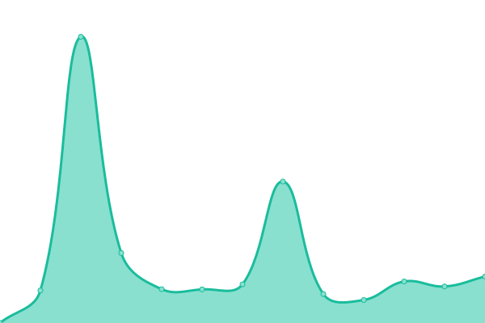

# [📈 Live Status](https://status.opensourcepos.org): <!--live status--> **🟩 All systems operational**

This repository contains the open-source uptime monitor and status page for [opensourcepos](https://status.opensourcepos.org), powered by [Upptime](https://github.com/upptime/upptime).

With [Upptime](https://upptime.js.org), you can get your own unlimited and free uptime monitor and status page, powered entirely by a GitHub repository. We use [Issues](https://github.com/opensourcepos/opensourcepos/issues) as incident reports, [Actions](https://github.com/opensourcepos/opensourcepos/actions) as uptime monitors, and [Pages](https://status.opensourcepos.org) for the status page.

<!--start: status pages-->
<!-- This summary is generated by Upptime (https://github.com/upptime/upptime) -->
<!-- Do not edit this manually, your changes will be overwritten -->
<!-- prettier-ignore -->
| URL | Status | History | Response Time | Uptime |
| --- | ------ | ------- | ------------- | ------ |
|  [Demo](https://demo.opensourcepos.org) | 🟩 Up | [demo.yml](https://github.com/opensourcepos/upptime/commits/HEAD/history/demo.yml) | 

 533ms
     
 | 

<a href="https://status.opensourcepos.org/history/demo">90.75%</a>
    

|  [Dev](https://dev.opensourcepos.org) | 🟩 Up | [dev.yml](https://github.com/opensourcepos/upptime/commits/HEAD/history/dev.yml) | 

 557ms
     
 | 

<a href="https://status.opensourcepos.org/history/dev">90.75%</a>
    

|  [Weblate](https://translate.opensourcepos.org) | 🟩 Up | [weblate.yml](https://github.com/opensourcepos/upptime/commits/HEAD/history/weblate.yml) | 

 2215ms
     
 | 

<a href="https://status.opensourcepos.org/history/weblate">92.47%</a>
    

<!--end: status pages-->

[**Visit our status website →**](https://status.opensourcepos.org)

## 📄 License

- Powered by: [Upptime](https://github.com/upptime/upptime)
- Code: [MIT](./LICENSE) © [jekkos](https://github.com/jekkos)
- Data in the `./history` directory: [Open Database License](https://opendatacommons.org/licenses/odbl/1-0/)
